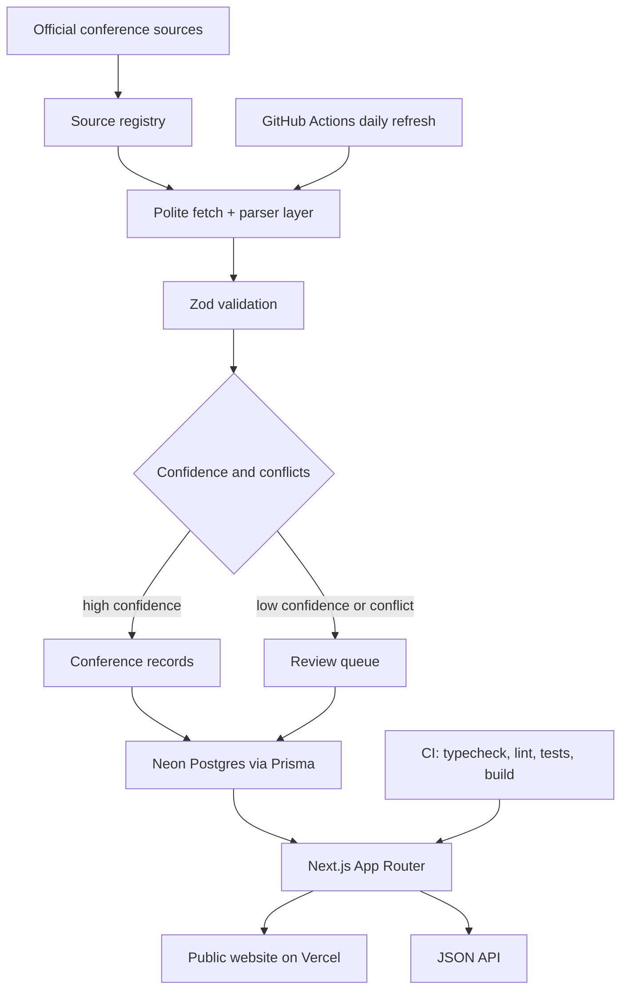

# ConfAI

ConfAI is a source-grounded website for European scientific conferences in AI, psychology, cognitive science, HCI, human-AI interaction, cognitive neuroscience, neurotechnology, and adjacent interdisciplinary fields.

The project is built for a public GitHub repository and Vercel deployment. It uses a review-first data policy: scraped or imported facts should not become public unless they have source URLs, `last_checked_at`, confidence metadata, and review status.

## Current State

- Next.js App Router, TypeScript, Tailwind CSS, and shadcn-compatible component patterns.
- Prisma schema for Neon Postgres.
- Reviewed seed record for [Letnia Szkola Kognitywistyki](https://lsk.kul.pl/), a Polish-language Poland-only source.
- Candidate source registry for major AI, ML, HCI, cognitive science, and neuroscience conference families.
- Public pages for search, detail records, deadlines, source registry, and methodology.
- JSON API endpoints for conferences and deadlines.
- GitHub Actions CI and a dry-run daily refresh workflow.

## Architecture



## Local Setup

```bash
npm install
cp .env.example .env
npm run dev
```

Open `http://localhost:3000`.

For Neon, set `DATABASE_URL` in `.env`, GitHub Actions secrets, and Vercel environment variables. Do not commit `.env`.

## Scripts

- `npm run dev` starts local development.
- `npm run build` builds the Next.js app.
- `npm run typecheck` runs TypeScript checks.
- `npm run lint` runs ESLint.
- `npm test` runs Vitest.
- `npm run db:validate` validates `prisma/schema.prisma`.
- `npm run refresh:dry-run` validates seed/source data and writes `artifacts/last-refresh-summary.json`.

## Data Policy

- Official conference pages are preferred over third-party listings.
- Missing dates, fees, locations, or themes remain missing.
- Polish-language sources are allowed only for Poland.
- The public archive keeps future conferences and conferences that ended within the last month.
- Candidate source families must pass source-policy review before scraping.
- AI-generated or unconfirmed sources with blank links are excluded.

## Deployment Notes

Target repository: `AlbertL97/confai`.

Target hosting: Vercel account/team `albertl97s-projects`.

Live production URL: [https://confai-henna.vercel.app](https://confai-henna.vercel.app)

Required Vercel environment variables:

- `DATABASE_URL`
- `REFRESH_MODE`
- `CONFIDENCE_THRESHOLD`

Automatic GitHub-to-Vercel deployment is intended, but repository creation, push, Vercel connection, and production deployment must be performed and verified explicitly.

Current deployment status: production deployment is live and returns HTTP 200.

## Screenshots and GIFs

Add screenshots or short GIFs after the first local or preview deployment is running. Suggested captures:

- homepage dashboard;
- conference list with filters;
- LSK detail page with provenance;
- deadline timeline;
- source registry.
